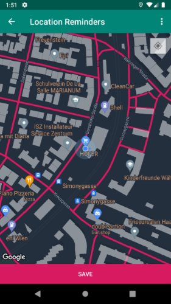

# Location Reminder

a Location Reminder App with notifications that remind the user to do something when the user is at a specific location. 

built as part of the udacity nanodegree Android Kotlin Developer

## Screenshots
 
 

## Report Issues
Notice any issues with a repository? Please file a GitHub issue in the repository.

## License
Copyright 2018, The Android Open Source Project

Licensed under the Apache License, Version 2.0 (the "License");
you may not use this file except in compliance with the License.
You may obtain a copy of the License at

      http://www.apache.org/licenses/LICENSE-2.0

Unless required by applicable law or agreed to in writing, software
distributed under the License is distributed on an "AS IS" BASIS,
WITHOUT WARRANTIES OR CONDITIONS OF ANY KIND, either express or implied.
See the License for the specific language governing permissions and
limitations under the License.

